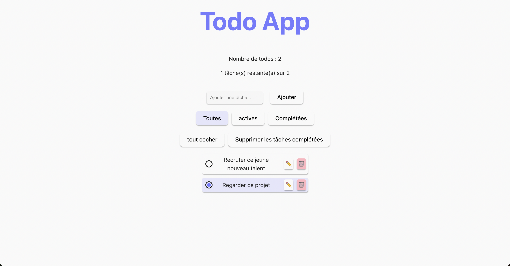

# 📝 Todo App - React

Une application de gestion de tâches moderne et interactive, construite avec React et @dnd-kit pour le drag & drop.



## ✨ Fonctionnalités

- ✅ **Gestion complète des tâches** : Ajouter, éditer, supprimer
- 🎯 **Filtrage intelligent** : Afficher toutes / actives / complétées
- ✏️ **Édition en ligne** : Bouton pour éditer (Enter pour valider, Escape pour annuler)
- 🔄 **Drag & Drop** : Réorganiser les tâches par glisser-déposer
- 💾 **Persistance des données** : Sauvegarde automatique dans localStorage
- 🎨 **Interface moderne** : Design épuré avec feedback visuel
- ⚡ **Actions rapides** : Tout cocher/décocher, supprimer les complétées

## 🚀 Démo

[Lien vers la démo live](https://todo-app-react-violet.vercel.app/)

## 🛠️ Technologies utilisées

- **React 19** - Bibliothèque UI
- **Vite** - Build tool moderne et rapide
- **@dnd-kit** - Drag & drop accessible et performant
- **localStorage** - Persistance des données côté client
- **CSS3** - Styling personnalisé

## 📦 Installation

### Prérequis
- Node.js 16+ et npm

### Étapes

1. Cloner le repository
```bash
git clone https://github.com/YannG75/TodoApp-React.git
cd TodoApp-React
```

2. Installer les dépendances
```bash
npm install
```

3. Lancer le serveur de développement
```bash
npm run dev
```

4. Ouvrir [http://localhost:5173](http://localhost:5173) dans votre navigateur

## 🏗️ Structure du projet
```
src/
├── components/
│   ├── TodoForm.jsx      # Formulaire d'ajout de tâche
│   ├── TodoItem.jsx      # Item de tâche avec drag & drop
│   └── TodoList.jsx      # Liste des tâches
├── App.jsx               # Composant principal + logique
├── App.css               # Styles globaux
└── main.jsx              # Point d'entrée
```

## 🎯 Concepts React mis en pratique

- **Hooks** : useState, useEffect, useSortable
- **Props & État** : Gestion d'état local et props drilling
- **Composants réutilisables** : Architecture modulaire
- **Event handling** : Gestion des événements clavier et souris
- **Conditional rendering** : Affichage conditionnel (mode édition, filtres)
- **Liste et clés** : Rendu de listes avec keys uniques
- **Side effects** : Synchronisation avec localStorage

## 🎨 Fonctionnalités techniques

### Drag & Drop optimisé
- Utilisation de `@dnd-kit` avec sensors personnalisés
- Activation après 10px de déplacement (souris) ou 250ms de pression (tactile)
- Évite les conflits avec les interactions de clic

### Gestion d'état
- État local pour l'édition (dans TodoItem)
- État global pour la liste (dans App)
- Synchronisation automatique avec localStorage

### UX soignée
- Raccourcis clavier (Enter, Escape)
- Feedback visuel (curseur, opacité pendant le drag)
- Style différencié pour les tâches complétées

<!--
## Améliorations possibles

- [ ] Mode sombre / clair
- [ ] Catégories / tags pour les tâches
- [ ] Date d'échéance et rappels
- [ ] Backend avec API REST
- [ ] Authentification utilisateur
- [ ] Tests unitaires et d'intégration -->

## 👨‍💻 Auteur

**Yann** - Développeur Front-End  
[LinkedIn](https://www.linkedin.com/in/yann-grillon/) <!-- | [Portfolio](#) -->

<!--
## 📄 Licence

Ce projet est open source et disponible sous [licence MIT](LICENSE).
-->
---

⭐ N'hésitez pas à star le projet si vous l'avez trouvé utile !